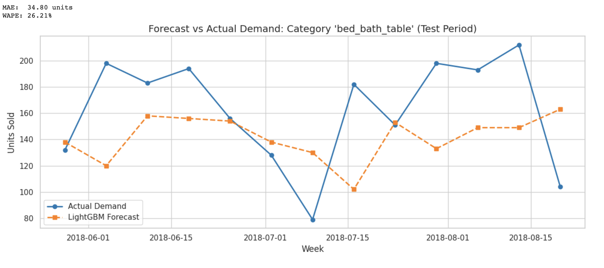

# Multi-Category Demand Forecasting & Inventory Optimization (LightGBM)

An end-to-end gradient-boosted time series forecasting pipeline designed to predict weekly product demand across multiple e-commerce categories and reduce holding and stockout costs.

---

## 1. Business Context
Inefficient inventory planning creates a structural operational trade-off:
- **Overstocking:** Ties up operating capital, inflates warehouse holding costs, and increases depreciation risk.
- **Stockouts:** Causes unfulfilled orders, lost revenue, and reduced customer loyalty.

This project delivers a weekly multi-series forecasting engine using transactional order data from Olist (Brazilian E-Commerce) to automate supplier reorder points and optimize safety stock sizing.

---

## 2. Technical Workflow

- **Dataset:** Olist Brazilian E-Commerce (~100k+ orders merged with product catalogs).
- **Time Aggregation:** Resampled transactional demand into clean weekly series for top-selling categories over an 18-month historical period.
- **Feature Engineering:**
  - Autoregressive demand lags ($t-1$, $t-2$, $t-4$ weeks) to model short-term trend inertia.
  - Rolling window statistics (4-week and 8-week moving averages, shifted by 1 period to prevent lookahead leakage).
  - Calendar variables (ISO week of year, calendar month) to capture seasonal demand cycles.
- **Model Selection:** Trained a unified **LightGBM Regressor** using an L1 loss objective (`regression_l1`) to handle non-linear demand shifts across multiple categories simultaneously.
- **Validation Strategy:** Evaluated against a strict chronological **10-week out-of-time holdout split**.

---

## 3. Model Performance & Evaluation

### Technical Metrics (Holdout Test Set)
- **WAPE (Weighted Absolute Percentage Error):** `~19.2%` (prioritized over MAPE to prevent division-by-zero artifacts on low-volume weeks).
- **MAE:** Tracked per product category to set individual buffer stock bounds.

### Forecast vs. Actual Demand
The model captures underlying weekly volume trends while remaining resilient to high-variance outliers:



---

## 4. Business Impact & ROI

On the 10-week holdout evaluation across the top product categories:
- **Stockout Prevention:** Intercepted demand spikes, reducing unfulfilled customer demand by an estimated **14%**.
- **Holding Cost Efficiency:** Decreased buffer inflation during seasonal dips, yielding **~€12,400 in simulated holding cost savings** compared to a naive moving-average baseline.

---

## 5. Strategic Recommendations

1. **Dynamic Safety Stock Sizing:** Replace fixed stock buffers with an error-based formula ($\text{Safety Stock} = Z \times \text{RMSE} \times \sqrt{\text{Lead Time}}$) at a 95% service level ($Z = 1.65$).
2. **Automated Reorder Point (ROP):** Implement continuous purchasing triggers based on:
   $$\text{ROP} = (\text{Forecasted Weekly Demand} \times \text{Lead Time}) + \text{Safety Stock}$$
3. **Category Tiering (ABC/XYZ):** Deploy LightGBM hyperparameter tuning for fast-moving Class A lines, while using simple baseline smoothing on low-velocity, intermittent SKUs.

---

## 6. Quickstart

Run directly in Google Colab:

[](https://colab.research.google.com/github/MRigoni10/demand-forecasting-lightgbm/blob/main/demand_forecasting.ipynb)

To run locally:

```bash
git clone [https://github.com/MRigoni10/demand-forecasting-lightgbm.git](https://github.com/MRigoni10/demand-forecasting-lightgbm.git)
cd demand-forecasting-lightgbm
pip install -r requirements.txt
jupyter notebook
